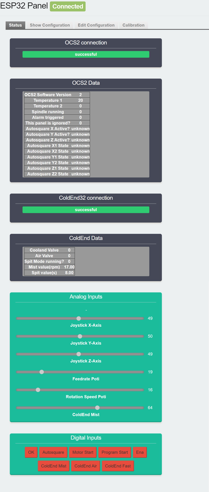
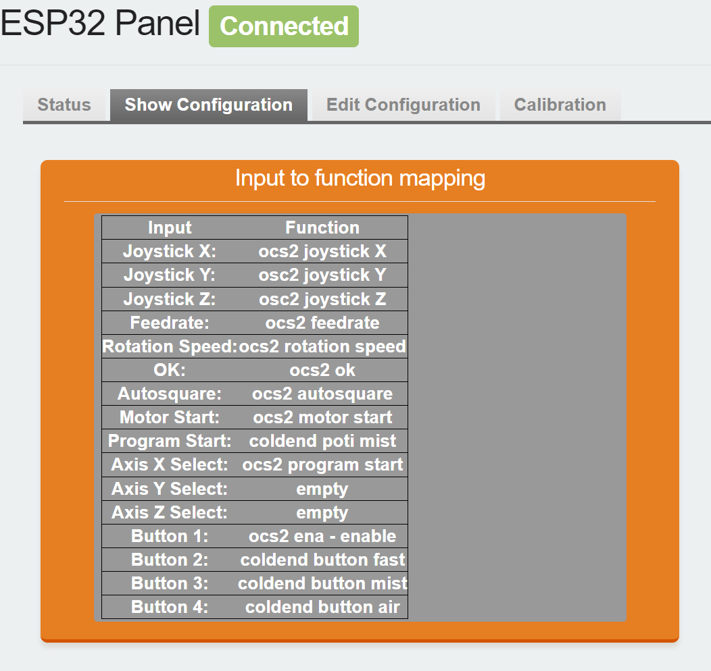
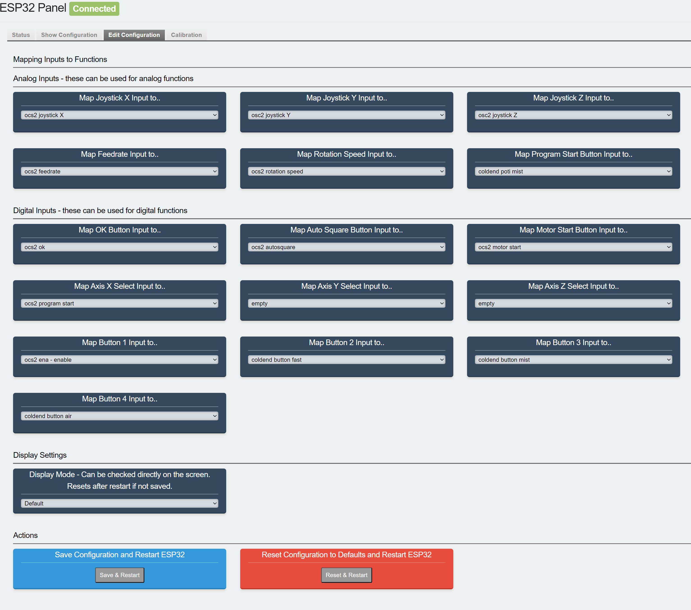
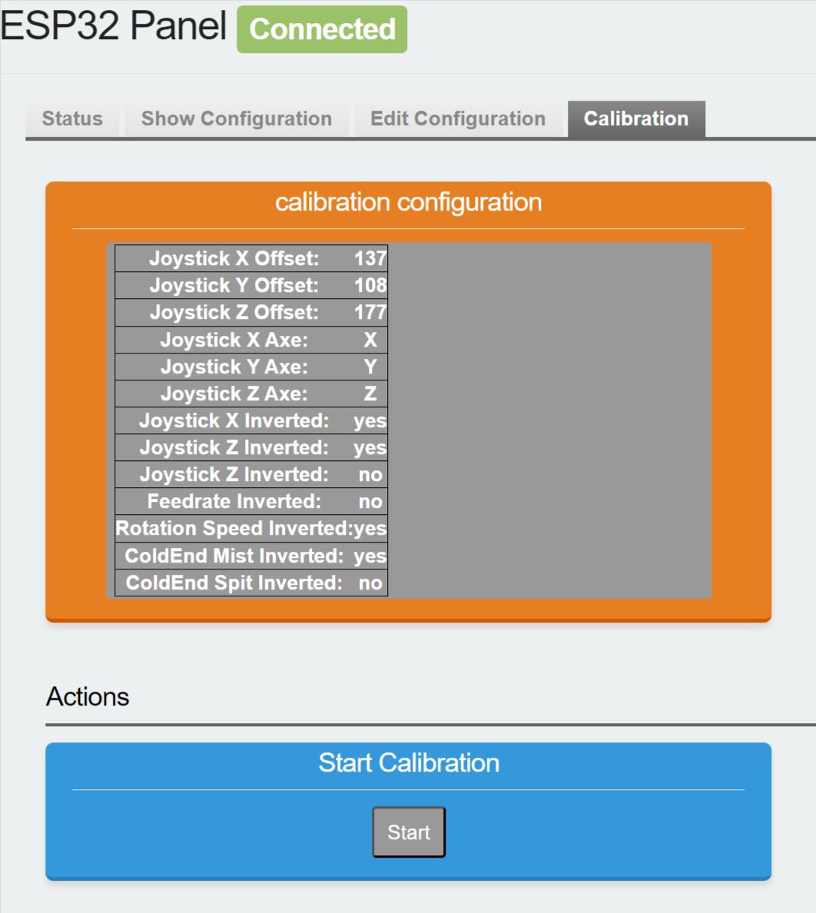
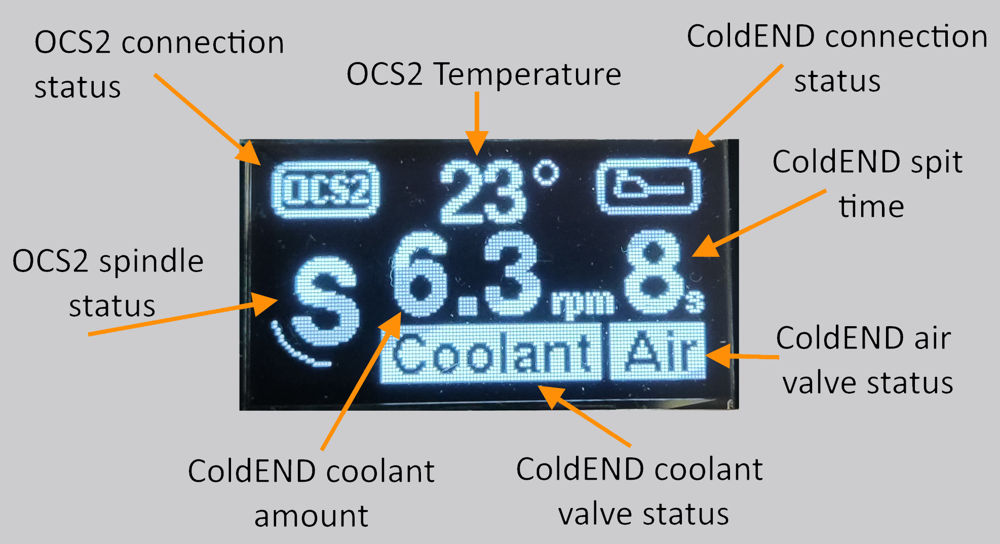
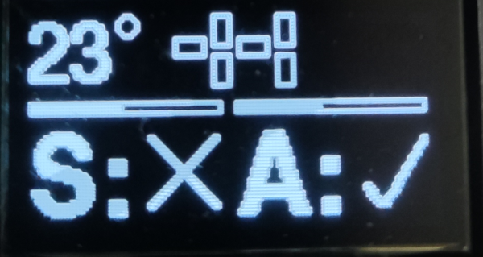
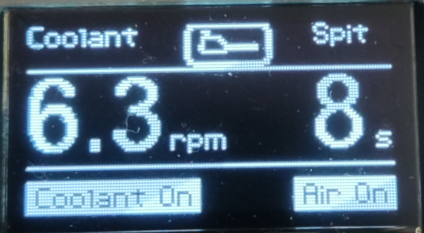

# OPEN-CNC-Shield 2.x ESP32 Panel Software

This project contains the software for an ESP32 handwheel as an remote control for the OPEN-CNC-Shield 2.x or/and the ColdEnd32 and is still under development.
The corresponding ESP32 software of the OPEN-CNC-Shield ESP32 can be found here: [OPEN-CNC-Shield 2.x ESP32 Software](https://github.com/timo1235/ocs2.x-esp32-software).
The corresponding ESP32 software of the ColdEnd32 can be found here: [ColdEnd32 fork with WiFi functionalities](https://github.com/timo1235/ColdEND32-WiFi).

## Howto install

Open this project folder in VS Code with PlatformIO IDE and upload it to the ESP32. A good documentation how to get the IDE up and running can be found here:
[Getting Started with VS Code and PlatformIO IDE](https://randomnerdtutorials.com/vs-code-platformio-ide-esp32-esp8266-arduino/)

## Configuration

The configuration is made in the webinterface of the ESP32. Just connect to the ESP32 via WiFi and open the IP address in your browser. The default IP address is '192.168.4.1'.

## Features implemented

- Read inputs and send them via Wifi to the Shield ESP32 [OCS2 ESP32 Software](https://github.com/timo1235/ocs2.x-esp32-software)
- Read inputs and send them via Wifi to the ColdEnd ESP32 [ColdEnd32 fork with WiFi functionalities](https://github.com/timo1235/ColdEND32-WiFi)
- Show the current status on a i2c display
- Calibrate all analog inputs like the joystick axes and feedrate and rotation speed poti
  - very useful if the axes are swaped or the middle position is not right

## Webinterface

The webinterface is automatically started after the software is uploaded to the esp32. You can connect to the esp32 via WiFi - it creates an hotspot named like `ESP32-Panel-XXXXXX`. Connect to that hotspot and open the browser, if I does not start automatically. The address of the webinterface should be http://192.168.4.1.

### Disable webinterface

The webinterface functionality does not interfere with the normal functionality of the esp32. But If you want to disable the webinterface, just comment out the line `#define USE_WIFI_WEBINTERFACE` in the `src/configuration.h` file.

## Display

A 0.96" I2C OLED display can be used to show status information of the connected open cnc shield 2 or coldend. The display can be configured to show the status of the open cnc shield 2, the coldend or both.
Just change the value in the webinterface on the `Edit Configuration` tab.

### Default display mode

In this mode the display will automatically adjust. The picture shows the display state if the open cnc shield 2 is connected and the coldend is also connected. If there are no functions defined for the coldend in the input configuration, the display will switch to the open cnc shield 2 only mode. Vice-Versa if there are no open cnc shield 2 funtions defined in the input configuration, the display will switch to the coldend only mode.

### Open CNC Shield 2 only mode

This mode uses the same design as the original open cnc shield 2 display.

### ColdEnd only mode

This mode uses the same design as the original coldend display.

## Menu Button

The menu button on the board has currently no special function. It just restarts the esp32.

## To be done

- implement connection over RJ45 - Serial communication

# Changelog

## 2.0.0

- Added WiFi webinterface
  - Configure the ESP32 via webinterface
  - See the status of all inputs
  - See the status of the connected ocs2
  - See the status of the connected coldend
- Added ColdEnd support [ColdEnd32 Fork with WiFi functionalities](https://github.com/timo1235/ColdEND32-WiFi)
- Added display modes
  - Use display for coldend only
  - Use display for ocs2 only
  - Use display for both
- Added clang-format file for automatic formatting
- Made configuration of inputs dynamically, so you can use any input for any function, as long as the input supports that(analog/digital) inputs
- Added all analog functions for the calibration process, which includes coldend mist poti and coldend spit poti
- Removed menu button function since the configuration is now made in the webinterface

## 1.0.0

- initial release
